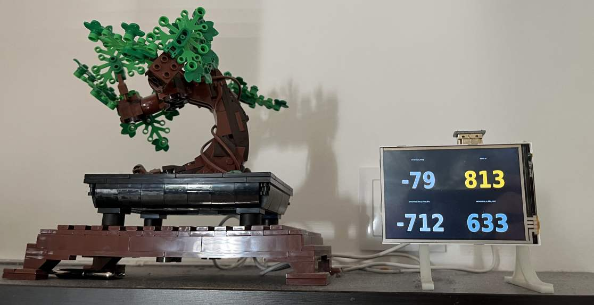

# hamon - Home Assistent Monitor



## Install

### Packages

```bash
sudo apt install python3-qtpy fonts-dseg
```

### Autostart

Add hamon to autostart file

```bash
mkdir -p ~/.config/autostart
nano ~/.config/autostart/python-script.desktop
```
```
[Desktop Entry]
Type=Application
Name=Home Assistent Monitor
Exec=/usr/bin/python3 /home/pi/hamon.py
X-GNOME-Autostart-enabled=true
```

or

```bash
vi ~/.config/lxsession/LXDE/autostart
```

```
@python3 /home/pi/hamon.py
```

### Screensaver

```bash
sudo apt remove xscreensaver
```

Disable Screen Blanking with Raspberry Pi Software Configuration Tool (raspi-config)
```
2 Display Options
  D2 Screen Blanking
    Would you like to enable screen blanking? No
```

## Adjust

### 🔐 Creating an Access Token for Home Assistant (for Python API Access)

1. Open your user profile
In Home Assistant, click your **username** in the bottom-left corner to open your profile.

2. Switch to the **“Security”** tab
At the top of the profile page, switch to the **“Security”** tab to access the token management section.

3. Create a long-lived access token
Scroll down to the section **“Long-Lived Access Tokens”** and click **“Create Token”**.

Give the token a name (e.g., *hamon*) and confirm by clicking **“Create Token”**.

> ⚠️ **Important:** The token is shown only once. Copy it and store it securely.

---

### 🔧 Adjustments in the Python program

- Replace the token at **`REPLACE_ME_WITH_YOUR_TOKEN`**.
- Copy the sensor names from Home Assistant and replace them in the Python code at **`REPLACE.sensor`**.
- Use **`VALUE_COLORS`** to customize the colors for each value.
- Use **`UPDATE_INTERVAL_MS`** to adjust the update interval.
- Set **`HA_URL`** to the URL or IP address of your Home Assistant instance.
