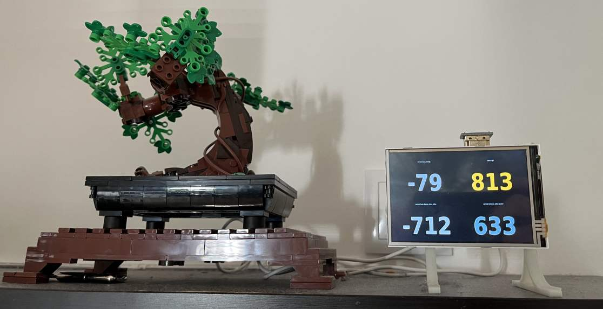

# hamon - Home Assistent Monitor



## Install

```bash
sudo apt install python3-qtpy fonts-dseg git
git clone https://github.com/mstroh76/hamon.git
cd hamon
```

## Adjust programm

### 🔐 Creating an Access Token for Home Assistant (for Python API Access)

1. Open your user profile
In Home Assistant, click your **username** in the bottom-left corner to open your profile.

2. Switch to the **“Security”** tab
At the top of the profile page, switch to the **“Security”** tab to access the token management section.

3. Create a long-lived access token
Scroll down to the section **“Long-Lived Access Tokens”** and click **“Create Token”**.

Give the token a name (e.g., *hamon*) and confirm by clicking **“Create Token”**.

> ⚠️ **Important:** The token is shown only once. Copy it and store it securely.

---

### 🔧 Configuration file 'hamon.conf'

All settings are stored in a configuration file, which is used by 'hamon.py' and 'hamon-cli-test.py'.

```bash
mkdir -p ~/.config/hamon
cp hamon.conf.example ~/.config/hamon/hamon.conf
chmod 600 ~/.config/hamon/hamon.conf
nano ~/.config/hamon/hamon.conf
```

The file is searched in `~/.config/hamon/hamon.conf`, next to `hamon.py` and in `/etc/hamon.conf`.
A different file can be passed with `hamon.py -c /path/to/hamon.conf`.

Section **`[homeassistant]`**
- **`url`**: URL or IP address of your Home Assistant instance.
- **`token`**: Replace **`REPLACE_ME_WITH_YOUR_TOKEN`** with your access token.

Section **`[display]`**
- **`update_interval_ms`**: Update interval in milliseconds.
- **`font_family`**: Font for the values, e.g. `DejaVu Sans`, `DSEG7 Classic` or `DSEG14 Classic`.
- **`font_size`**: Font size in points, or `auto` to fit the values to the screen.
- **`font_bold`**: `yes` or `no`.

Section **`[entities]`**
- One line per value: **`entity_id = color`**. Copy the sensor names from Home Assistant and replace **`REPLACE.sensor`**.
- Two values are shown per row: 4 entries give a 2-row display, 6 entries give a 3-row display.

```ini
[entities]
sensor.living_room_temperature = #FFFFFF
sensor.outdoor_temperature = #FFA500
sensor.power_consumption = #DCE6BC
sensor.solar_power = #ADD8E6
```

### 🧪 Testing

```bash
python3 hamon-cli-test.py
```

### ✅ Storing

```bash
sudo cp hamon.py /usr/local/bin
```

## Start program

### Autostart

Add hamon to autostart file

```bash
mkdir -p ~/.config/autostart
nano ~/.config/autostart/python-script.desktop
```
```
[Desktop Entry]
Type=Application
Name=Home Assistent Monitor
Exec=/usr/bin/python3 /usr/local/bin/hamon.py
X-GNOME-Autostart-enabled=true
```

or

```bash
vi ~/.config/lxsession/LXDE/autostart
```

```
@python3 /usr/local/bin/hamon.py
```

### Screensaver

```bash
sudo apt remove xscreensaver
```

Disable Screen Blanking with Raspberry Pi Software Configuration Tool (raspi-config)
```
2 Display Options
  D2 Screen Blanking
    Would you like to enable screen blanking? No
```

### Autologin

Raspberry Pi Software Configuration Tool (raspi-config)
```
1 System Options
  S6 Auto Login
    Would you like to automatically log in to the console? No
    Would you like to automatically log in to the desktop? Yes

Would you like to reboot now? Yes
```
